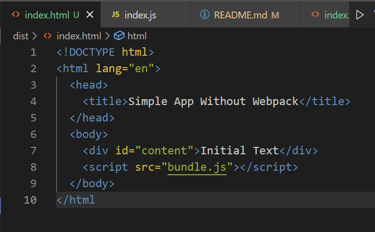
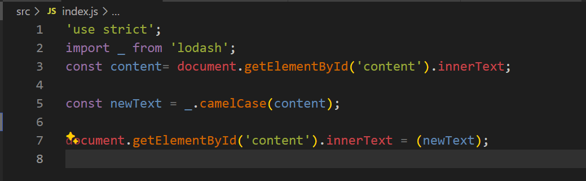
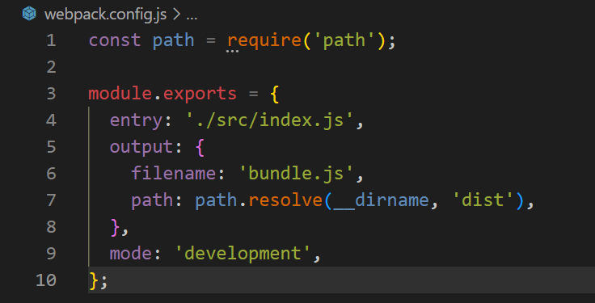

# webpack-demo

Lets develop the understanding of Webpack by setting up a basic Webpack configuration in a new project by creating a simple web application that uses Webpack to bundle JavaScript modules and includes basic configuration for handling CSS files.

## Create the Basic App (Without Webpack)

Created a new directory called webpack-demo.
Navigated into project directory and run npm init -y to create a new npm project.

### HTML Structure:

Created a dist/index.html file with the following content in the body

### JavaScript Functionality:

- Create a src/index.js file and add the following code:

### Observe the Error:

- Opened dist/index.html in the browser and check the console. It threw an error because Lodash wasn't installed or bundled. Took a screenshot of the error message for assignment submission.

## Set Up Webpack and Fix the Error
### Install Webpack:

In the project directory, run npm install --save-dev webpack webpack-cli 

### Created a Webpack Configuration File:

In your project root, create a webpack.config.js file with the following content:

### Bundle with Webpack:

Added a build script in package.json: "build": "webpack".
Ran 'npm run build' to bundle the application which resolved the Lodash error by bundling the dependencies.
### Verify the Application:

Opened dist/index.html in the browser to ensure that the text had updated to camel casing without errors.

